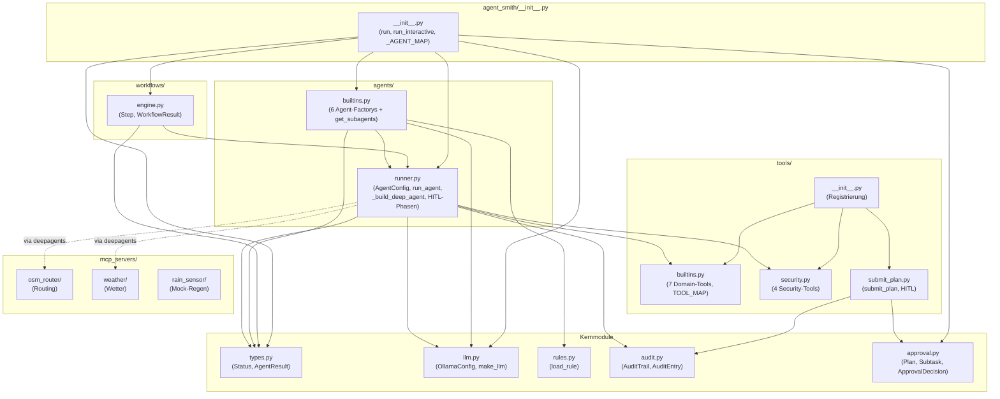
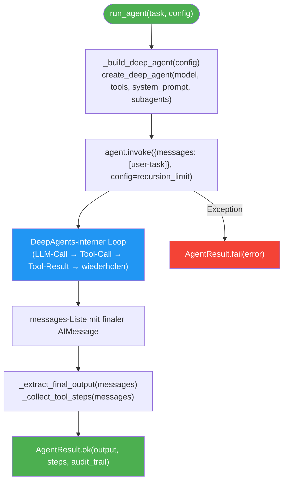
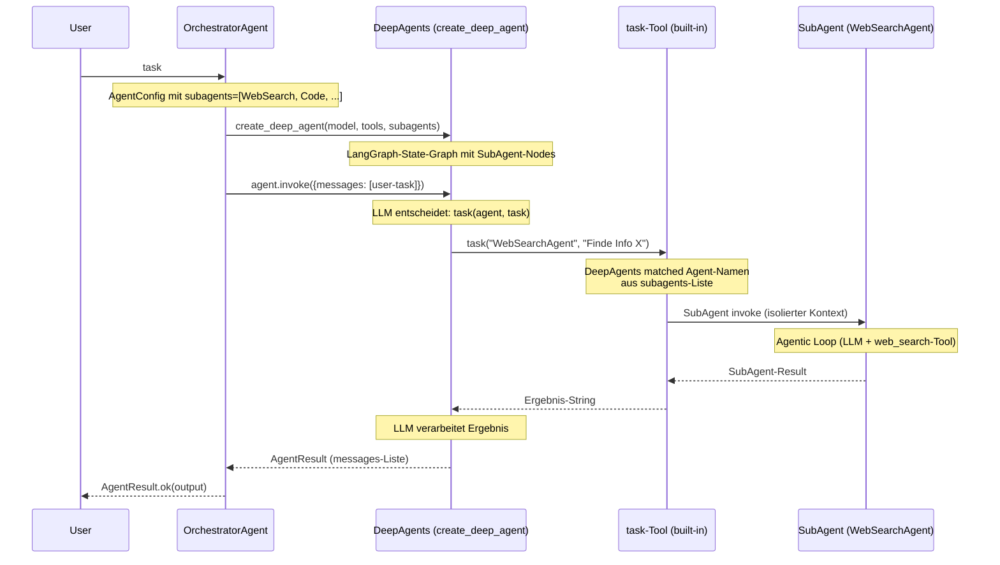
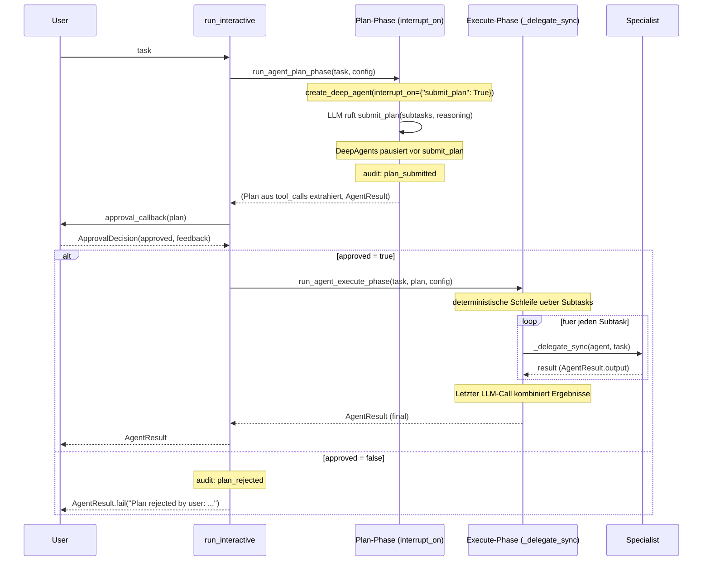
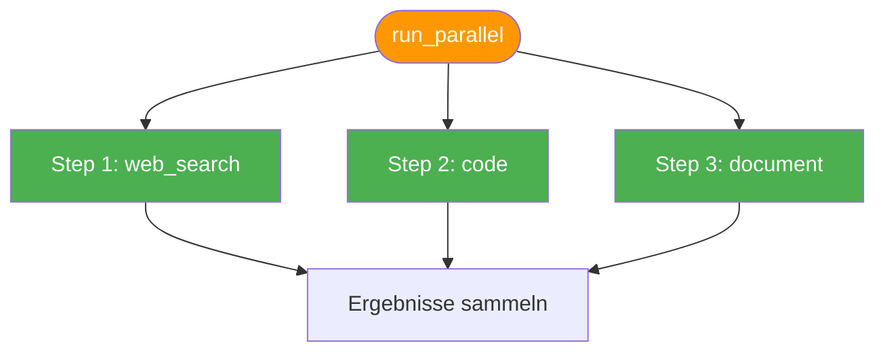
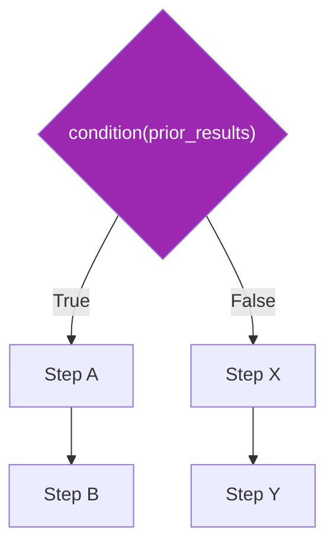

# Architektur — agent-smith (DeepAgents Edition)

> Vollstaendige Architekturbeschreibung der DeepAgents-basierten Agenten-Engine.

---

## 1. Einfuehrung

agent-smith ist eine modulare Agenten-Engine fuer Ollama-basierte LLMs. Die Architektur
folgt einem streng funktionalen Paradigma — keine Agenten-Klassen, keine Vererbung,
keine Framework-Abstraktionen jenseits der LangChain-Nutzung in isolierten Modulen.

**Kernprinzipien:**

- **Funktionaler Stil** — Alles sind Funktionen und Dataclasses, keine Klassen hierarchien
- **DeepAgents-basiert** — Der agentic loop wird von DeepAgents (`create_deep_agent`) auf LangGraph gemanaged; LangChain/LangGraph-Typen sind auf `llm.py` und `runner.py` beschraenkt
- **Ollama-only** — Keine OpenAI/Anthropic/andere Provider
- **Rule-basierte Agenten** — Agentenkonfiguration in Markdown-Dateien mit YAML-Frontmatter
- **SubAgent-Delegation** — Der Orchestrator delegiert Subtasks via DeepAgents' built-in `task`-Tool mit konfigurierten SubAgents
- **Audit Trail** — Vollstaendige Nachverfolgung aller LLM-Aufrufe, Tool-Calls und Delegationen

---

## 2. Verzeichnisstruktur

```
agent-smith/
├── agent_smith/                 # Kernpaket
│   ├── __init__.py             # Oeffentliche API, run()/run_interactive()
│   ├── types.py                # Status, AgentResult
│   ├── llm.py                  # OllamaConfig, LLM-Factory
│   ├── rules.py                # Markdown-Frontmatter-Parser
│   ├── audit.py                # AuditTrail, AuditEntry + Context-Vars
│   ├── approval.py             # Subtask, Plan, ApprovalDecision (HITL)
│   ├── agents/
│   │   ├── __init__.py         # Re-exports
│   │   ├── runner.py           # DeepAgents-Agentic-Loop + Plan/Execute-Phase
│   │   └── builtins.py         # 6 vordefinierte Agenten + get_subagents()
│   ├── tools/
│   │   ├── __init__.py         # Re-exports + submit_plan + security Registrierung
│   │   ├── builtins.py         # 7 Domain-Tools + Registry
│   │   ├── submit_plan.py      # Plan-Submission-Tool (HITL)
│   │   └── security.py         # 4 Security-Tools (bandit, secret, audit, combined)
│   ├── memory/                 # Legacy (DeepAgents managed context intern)
│   │   ├── __init__.py
│   │   └── store.py            # Sliding-Window, last_assistant_text
│   └── workflows/
│       ├── __init__.py
│       └── engine.py           # Sequential, Parallel, Conditional
├── mcp_servers/                # MCP-Server (extern)
│   ├── osm_router/
│   │   ├── server.py           # OpenStreetMap Routing (FastMCP)
│   │   └── client.py           # Sync Wrapper
│   ├── weather/
│   │   ├── server.py           # Wetterdaten (FastMCP)
│   │   └── client.py           # Sync Wrapper
│   └── rain_sensor/
│       └── server.py           # Rain Sensor Mock-Server (SSE)
├── rules/                      # Agenten-Definitionen (Markdown)
│   ├── web_search.md
│   ├── code.md
│   ├── document.md
│   ├── api.md
│   ├── data.md
│   └── orchestrator.md
├── tests/                      # Unit- und Integrationstests
│   ├── test_agent_smith.py
│   ├── test_hitl.py            # HITL-spezifische Tests
│   ├── test_security.py        # Security-Tool-Tests
│   ├── test_mcp_routing.py     # MCP-Routing-Tests
│   └── test_ollama_integration.py
├── docs/                       # Dokumentation
├── examples/                   # Beispielcode
├── pyproject.toml              # Build-Config + Abhaengigkeiten
└── AGENTS.md                   # Agenten-Infrastruktur-Doku
```

---

## 3. Abhaengigkeiten

### 3.1 Externe Pakete

| Paket | Version | Zweck |
|-------|---------|-------|
| `deepagents` | >=0.6.12 | Agent-Harness (agentic loop, SubAgent-Delegation, HITL-Interrupts) |
| `langchain` | >=1.0.0 | LLM-Framework (transitiv ueber DeepAgents) |
| `langchain-ollama` | >=0.3.0 | Ollama LLM-Provider (`ChatOllama`) |
| `langchain-core` | >=0.3.0 | Core-Typen (`AIMessage`, `ToolMessage`, etc.) |
| `httpx` | >=0.27.0 | HTTP-Client fuer `http_get`/`http_post` |
| `pandas` | >=2.0.0 | CSV-/Data-Analyse-Tools |
| `ddgs` | >=7.0.0 | DuckDuckGo-Suche (`web_search`) |
| `mcp[cli]` | >=1.27 | MCP-Server-SDK (fuer MCP-Server) |

### 3.2 Interne Abhaengigkeiten



---

## 4. Kernkomponenten

### 4.1 [`types.py`](../agent_smith/types.py) — Domaintypen

Keine externen Abhaengigkeiten. Reine stdlib-Typen.

```python
class Status(str, Enum):
    SUCCESS = "success"
    FAILED = "failed"

@dataclass
class AgentResult:
    status: Status
    output: Any
    error: str | None = None
    intermediate_steps: list = field(default_factory=list)
    audit_trail: AuditTrail = field(default_factory=AuditTrail)

    @property
    def success(self) -> bool: ...
    @classmethod
    def ok(cls, output, steps=None, audit_trail=None) -> AgentResult: ...
    @classmethod
    def fail(cls, error, audit_trail=None) -> AgentResult: ...
```

`AgentResult` ist das einheitliche Rueckgabeprotokoll aller Agenten-Aufrufe.
Das `audit_trail`-Feld enthaelt die vollstaendige Protokollierung aller Schritte.

### 4.2 [`llm.py`](../agent_smith/llm.py) — LLM-Factory

Einziges Modul (neben `runner.py`), das `ChatOllama` importiert.

```python
@dataclass(frozen=True)
class OllamaConfig:
    model: str = "gemma4:12b"
    base_url: str = "http://localhost:11434"
    temperature: float = 0.7
    max_tokens: int = 4096
    timeout: int = 120
    options: dict[str, Any] = field(default_factory=dict)

def make_llm(config: OllamaConfig) -> ChatOllama: ...
def make_llm_with_tools(config: OllamaConfig, tools: list) -> ChatOllama: ...
```

`make_llm_with_tools` ruft `make_llm(config).bind_tools(tools)` — so wird das
LangChain-Tool-Calling-Protocol verknuepft.

### 4.3 [`rules.py`](../agent_smith/rules.py) — Frontmatter-Parser

Liest Markdown-Dateien aus `rules/`, parst YAML-Frontmatter (hand-rolled, kein
yaml-Dependency) und liefert ein Konfigurationsdict.

```python
def load_rule(name: str) -> dict:
    """Laedt rules/{name}.md, parsed Frontmatter, liefert config-dict mit 'system_prompt'."""
```

**Parser-Logik:**
- Werte werden automatisch in int, bool oder komma-separierte Liste konvertiert
- Der Markdown-Body wird als `system_prompt` zurueckgegeben
- Einzelne Tool-Strings werden zu Listen normalisiert

### 4.4 [`agents/runner.py`](../agent_smith/agents/runner.py) — Agentic-Loop (DeepAgents)

Das Herzstueck. Der agentic loop wird von DeepAgents' `create_deep_agent`
gemanaged — LangChain/LangGraph-Typen sind auf dieses Modul beschraenkt.

**AgentConfig** — deterministische Konfiguration fuer einen Agenten:

```python
@dataclass(frozen=True)
class AgentConfig:
    name: str
    system_prompt: str
    llm: OllamaConfig = field(default_factory=OllamaConfig)
    tools: list[str] | None = None
    max_iterations: int = 10
    context_window: int = 20
    subagents: list = field(default_factory=list)  # DeepAgents SubAgent-Dicts
```

**run_agent** — delegiert den gesamten Loop an DeepAgents:

```python
def run_agent(task, config, audit_trail=None, level=0) -> AgentResult:
    agent = _build_deep_agent(config)         # create_deep_agent(...)
    invoke_config = {"recursion_limit": ...}
    result = agent.invoke(
        {"messages": [{"role": "user", "content": task}]},
        config=invoke_config,
    )
    output = _extract_final_output(result["messages"])
    return AgentResult.ok(output=output, ...)
```

**run_agent_plan_phase** — HITL Phase 1 mit Direkt-Invocation (kein DeepAgents-Graph):

```python
def run_agent_plan_phase(task, config, audit_trail=None, level=0):
    llm = make_llm(config.llm)
    bound_llm = llm.bind_tools([submit_plan])
    messages = [SystemMessage(config.system_prompt), HumanMessage(task)]
    for _ in range(max_attempts):
        response = bound_llm.invoke(messages)
        # Bei tool_calls mit submit_plan: Plan extrahieren
        if response.tool_calls:
            for tc in response.tool_calls:
                if tc["name"] == "submit_plan":
                    plan = parse_plan_from_args(tc["args"])
                    return plan, AgentResult.ok(...)
        # Sonst: erneut auffordern, submit_plan zu verwenden
        messages.append(HumanMessage("You must call submit_plan."))
    return None, AgentResult.ok(...)
```

> **Warum kein DeepAgents?** `create_agent` setzt `tool_choice=None` (LangChain-Factory,
> Zeile 634 in `factory.py`), wodurch das LLM `submit_plan` ignorieren kann. Mit
> `bind_tools` + Schleife erzwingen wir den Tool-Call mit automatischem Retry.

**run_agent_execute_phase** — HITL Phase 2, deterministische Ausfuehrung:

```python
def run_agent_execute_phase(task, plan, config, audit_trail=None, level=0):
    for subtask in plan.subtasks:
        result = _delegate_sync(subtask.agent, subtask.task, ...)
    # Letzter LLM-Call kombiniert alle Subtask-Ergebnisse
    final = llm.invoke([SystemMessage(...), HumanMessage(...)])
    return AgentResult.ok(output=final.content)
```

**Ablauf (siehe Abschnitt 6).**

### 4.5 [`agents/builtins.py`](../agent_smith/agents/builtins.py) — Vordefinierte Agenten

6 Agenten, jeweils als Factory-Funktion + Convenience-`run_*`-Funktion.
DeepAgents stellt built-in Dateisystem-Tools (`read_file`, `ls`, `glob`,
`grep`, `write_file`, `edit_file`) bereit — diese muessen nicht manuell
konfiguriert werden.

| Agent | Rule-Datei | Tools | max_iterations |
|-------|-----------|-------|----------------|
| WebSearchAgent | `web_search.md` | `web_search` | 10 |
| CodeExecutionAgent | `code.md` | `execute_python` | 10 |
| DocumentAgent | `document.md` | (DeepAgents built-in) | 10 |
| APIAgent | `api.md` | `http_get`, `http_post` | 10 |
| DataAgent | `data.md` | `read_csv`, `query_data`, `describe_data` | 10 |
| OrchestratorAgent | `orchestrator.md` | `submit_plan`, (SubAgents via `task`) | 20 |

Der Orchestrator erhaelt 20 Iterationen (doppelte Anzahl), da jede Delegation
als eine Iteration zaehlt.

**get_subagents()** — baut DeepAgents SubAgent-Dicts aus den Rule-Dateien:

```python
def get_subagents() -> list[dict]:
    """Jeder SubAgent hat: name, description, system_prompt, tools."""
    agents = []
    for rule_name in ("web_search", "code", "document", "api", "data"):
        cfg = load_rule(rule_name)
        agents.append({
            "name": cfg["name"],
            "description": cfg["system_prompt"].split("\\n")[0],
            "system_prompt": cfg["system_prompt"],
            "tools": cfg.get("tools") or [],
        })
    return agents
```

**Pattern fuer jeden Agenten:**

```python
def _agent_from_rule(name, llm=None) -> AgentConfig:
    cfg = load_rule(name)
    return AgentConfig(
        name=cfg["name"],
        system_prompt=cfg["system_prompt"],
        llm=llm or OllamaConfig(),
        tools=cfg["tools"],
        max_iterations=cfg.get("max_iterations", 10),
        context_window=cfg.get("context_window", 20),
    )

def web_search_agent(llm=None) -> AgentConfig:
    return _agent_from_rule("web_search", llm)

def run_web_search(task, llm=None, audit_trail=None, level=0) -> AgentResult:
    return run_agent(task, web_search_agent(llm), audit_trail=audit_trail, level=level)
```

Der Orchestrator erhaelt zusaetzlich die SubAgents:

```python
def orchestrator_agent(llm=None) -> AgentConfig:
    cfg = _agent_from_rule("orchestrator", llm)
    return replace(cfg, subagents=get_subagents())
```

Alle `run_*`-Funktionen akzeptieren optionale `audit_trail`- und `level`-Parameter
fuer die vollstaendige Nachverfolgung.

### 4.6 [`tools/builtins.py`](../agent_smith/tools/builtins.py) — Domain-Tools

7 Domain-Tools, dekoriert mit LangChain `@tool`. Jedes Tool faengt Fehler ab
und liefert ein Dict statt Exceptions. Dateisystem-Tools (`read_file`, `ls`,
`glob`, `grep`, `write_file`, `edit_file`) werden von DeepAgents built-in
bereitgestellt.

| Tool | Signatur | Beschreibung |
|------|----------|-------------|
| `web_search` | `(query: str, max_results: int = 5)` | DuckDuckGo-Suche |
| `execute_python` | `(code: str, timeout: int = 30)` | Python-Code in Subprocess |
| `http_get` | `(url: str, headers?, params?)` | HTTP GET |
| `http_post` | `(url: str, body: dict, headers?)` | HTTP POST |
| `read_csv` | `(path: str, max_rows: int = 100)` | CSV lesen |
| `describe_data` | `(path: str)` | Pandas describe |
| `query_data` | `(path: str, query: str, columns?)` | Pandas query-Filter |

**Globale Registry:**

```python
ALL_TOOLS = [
    web_search, execute_python,
    http_get, http_post,
    read_csv, describe_data, query_data,
]

TOOL_MAP: dict[str, object] = {t.name: t for t in ALL_TOOLS}

def get_tools(names=None) -> list:
    """Tools nach Name zurueckgeben, oder alle wenn names=None."""
```

### 4.7 Delegation via DeepAgents SubAgents

Der Orchestrator delegiert Subtasks nicht mehr ueber ein separates `delegate_to`-Tool,
sondern via DeepAgents' built-in `task`-Tool. Die fuenf Specialist-Agenten werden
als SubAgent-Dicts konfiguriert (siehe `get_subagents()` in 4.5).

```python
# In orchestrator_agent():
return replace(cfg, subagents=get_subagents())
```

DeepAgents injected automatisch ein `task`-Tool, mit dem der Orchestrator
SubAgents aufrufen kann. Der Dispatch erfolg nicht mehr manuell ueber ein
Dict, sondern wird von DeepAgents anhand der SubAgent-Konfiguration gemanaged:

| SubAgent | Role | Bereitgestellt durch |
|----------|------|---------------------|
| `WebSearchAgent` | Web-Recherche | `get_subagents()` |
| `CodeExecutionAgent` | Python-Code-Ausfuehrung | `get_subagents()` |
| `DocumentAgent` | Dateisystem-Zugriff | `get_subagents()` |
| `APIAgent` | HTTP-Requests | `get_subagents()` |
| `DataAgent` | CSV-Datenanalyse | `get_subagents()` |

Vorteile gegenueber dem alten `delegate_to`-Ansatz:
- **Kein manueller Dispatch** — DeepAgents matched Agent-Namen automatisch
- **Keine zirkulaeren Importe** — Lazy-Import-Pattern entfaellt komplett
- **Context-Isolation** — SubAgent sieht nur sein Ergebnis, nicht den gesamten Verlauf
- **Audit-Trail** — Wird von DeepAgents via LangSmith-Tracing oder eigenem Audit gefuehrt

### 4.8 [`tools/__init__.py`](../agent_smith/tools/__init__.py) — Registrierung

```python
from agent_smith.tools.builtins import ALL_TOOLS, TOOL_MAP, get_tools
from agent_smith.tools.submit_plan import submit_plan
from agent_smith.tools.security import (
    bandit_scan, secret_scan, audit_dependencies, security_scan,
)

for _t in (bandit_scan, secret_scan, audit_dependencies, security_scan):
    ALL_TOOLS.append(_t)
    TOOL_MAP[_t.name] = _t

ALL_TOOLS.append(submit_plan)
TOOL_MAP["submit_plan"] = submit_plan
```

Mutiert `ALL_TOOLS` und `TOOL_MAP` zur Import-Zeit — Security-Tools und
`submit_plan` sind danach im globalen Tool-Registry verfuegbar. Anders als
frueher gibt es kein `delegate_to`-Tool mehr (Delegation erfolgt via
DeepAgents' built-in `task`-Tool).

### 4.9 [`tools/security.py`](../agent_smith/tools/security.py) — Security-Tools

Vier Sicherheitsscanner als LangChain-Tools. Jedes Tool kapselt ein externes
Tool (bandit, gitleaks, pip-audit) mit einem Regex-Fallback fuer Umgebungen
ohne installierte Binaries.

| Tool | Scanner | Severities | Beschreibung |
|------|---------|------------|-------------|
| `bandit_scan(path)` | bandit (Python) | critical/warning/info | Erkennt gefaehrliche Funktionen (`eval`, `exec`, `pickle`, etc.) |
| `secret_scan(path)` | gitleaks / Regex-Fallback | critical | Erkennt Secrets (API-Keys, Passwoerter, Tokens) |
| `audit_dependencies()` | pip-audit | warning | Scannt Python-Dependencies auf bekannte CVEs |
| `security_scan(path)` | Alle drei kombiniert | — | Aggregierter Report mit BESTANDEN/NICHT BESTANDEN |

**Severity-Modell:**
- `critical` — blockiert den Push im Pre-Push-Hook
- `warning` — wird im Report vermerkt, blockiert nicht
- `info` — informelle Hinweise

### 4.10 [`tools/submit_plan.py`](../agent_smith/tools/submit_plan.py) — Plan-Submission (HITL)

Wird vom OrchestratorAgent in der Plan-Phase des Human-in-the-Loop-Flows
genutzt. Nimmt strukturierte Argumente entgegen und validiert den Plan.

```python
@tool
def submit_plan(
    subtasks: list[dict],
    reasoning: str = "",
) -> str:
    """
    Args:
        subtasks: List of {agent, task} objects
        reasoning: Optional explanation
    """
    Plan(subtasks=_coerce_subtasks(subtasks), reasoning=reasoning)
    return PLAN_SUBMITTED_MARKER  # "PLAN_SUBMITTED"
```

**Validierung in `_coerce_subtasks`:**
- Agent muss aus `VALID_AGENTS` stammen
- Task darf nicht leer sein
- Subtasks-Liste darf nicht leer sein

**Eingabeformat via `parse_plan_from_args`:**
- `{"subtasks": [...], "reasoning": "..."}` — strukturiertes Format (gemma4:12b)

### 4.11 [`approval.py`](../agent_smith/approval.py) — HITL-Datentypen

Reine Domain-Dataclasses fuer den Human-in-the-Loop-Flow. Keine
externen Abhaengigkeiten.

```python
@dataclass(frozen=True)
class Subtask:
    agent: str
    task: str

@dataclass
class Plan:
    subtasks: list[Subtask] = field(default_factory=list)
    reasoning: str = ""
    # to_json() / from_json() / format() Methoden

@dataclass(frozen=True)
class ApprovalDecision:
    approved: bool
    feedback: str | None = None

VALID_AGENTS = (
    "WebSearchAgent", "CodeExecutionAgent", "DocumentAgent",
    "APIAgent", "DataAgent",
)
```

`Plan.from_json()` validiert strikt: leerer Subtasks-Liste, unbekannte Agenten
und leere Tasks werden abgelehnt.

### 4.12 [`memory/store.py`](../agent_smith/memory/store.py) — Memory-Utilities (Legacy)

Funktionale Wrapper fuer Nachrichtenlisten.

```python
def window(messages: list[BaseMessage], max_messages: int) -> list[BaseMessage]:
    """Sliding Window, bewahrt fuehrenden SystemMessage auf."""

def last_assistant_text(messages: list[BaseMessage]) -> str | None:
    """Letzten AIMessage-Text zurueckgeben."""
```

> **Bekanntes Problem:** `window()` ist funktionsgleich mit `runner._trim()`
> (Code-Duplizierung).

### 4.13 [`workflows/engine.py`](../agent_smith/workflows/engine.py) — Workflow-Engine

Drei Ausfuehrungsmodi fuer mehrstufige Agenten-Pipelines.

```python
@dataclass(frozen=True)
class Step:
    name: str
    agent: AgentConfig
    task_fn: Callable[[dict[str, AgentResult]], str]

@dataclass
class WorkflowResult:
    steps: dict[str, AgentResult]
    final: AgentResult | None = None

    @property
    def success(self) -> bool: ...

def run_sequential(steps: list[Step]) -> WorkflowResult: ...
def run_parallel(steps: list[Step], max_workers: int = 4) -> WorkflowResult: ...
def run_conditional(condition, if_true, if_false, prior_results=None) -> WorkflowResult: ...
```

| Modus | Beschreibung |
|-------|-------------|
| `run_sequential` | Schrittweise Ausfuehrung, Ergebnisse werden weitergegeben, Abbruch bei Fehler |
| `run_parallel` | ThreadPoolExecutor, alle Steps gleichzeitig, jeder bekommt leeres prior_results |
| `run_conditional` | Laufzeit-Bedingung waehlt Branch, dann sequential-Ausfuehrung |

### 4.14 [`__init__.py`](../agent_smith/__init__.py) — Oeffentliche API

```python
_AGENT_MAP = {
    "web_search": run_web_search,
    "code": run_code,
    "document": run_document,
    "api": run_api,
    "data": run_data,
    "orchestrator": run_orchestrator,
}

def run(
    task: str,
    agent: str = "orchestrator",
    model: str = "gemma4:12b",
    base_url: str = "http://localhost:11434",
) -> AgentResult:
    """Convenience-Einstiegspunkt."""
    llm = OllamaConfig(model=model, base_url=base_url)
    runner = _AGENT_MAP.get(agent)
    if runner is None:
        raise ValueError(f"Unknown agent '{agent}'")
    return runner(task, llm=llm)


def _load_orchestrator_config(model: str, base_url: str) -> AgentConfig:
    cfg = load_rule("orchestrator")
    return AgentConfig(
        name=cfg["name"],
        system_prompt=cfg["system_prompt"],
        llm=OllamaConfig(model=model, base_url=base_url),
        tools=cfg.get("tools"),
        max_iterations=cfg.get("max_iterations", 20),
        context_window=cfg.get("context_window", 20),
        subagents=get_subagents(),
    )


def run_interactive(
    task: str,
    approval_callback: Callable[[Plan], ApprovalDecision],
    model: str = "gemma4:12b",
    base_url: str = "http://localhost:11434",
) -> AgentResult:
    """run_interactive: Plan-Phase (interrupt_on) → User-Approval → Execute-Phase."""
    config = _load_orchestrator_config(model, base_url)
    plan, phase1_result = run_agent_plan_phase(task, config)
    if plan is None:
        return phase1_result
    decision = approval_callback(plan)
    if not decision.approved:
        phase1_result.audit_trail.log(
            level=0, agent=config.name, action="plan_rejected",
            task=decision.feedback,
        )
        return AgentResult.fail(
            f"Plan rejected by user: {decision.feedback or 'no feedback'}",
            audit_trail=phase1_result.audit_trail,
        )
    return run_agent_execute_phase(task, plan, config, audit_trail=phase1_result.audit_trail)
```

### 4.15 [`audit.py`](../agent_smith/audit.py) — Audit-Trail (eigen)

Ergaenzt das interne DeepAgents-Tracing um projektspezifische Audit-Events.
Protokolliert besonders die HITL-Planung (plan_submitted/approved/rejected)
und die `_delegate_sync`-Aufrufe in der Execute-Phase. Bietet strukturierte
Konsolenausgabe und formatierte Berichte.

**Context-Variablen (fuer Tool-Delegation):**

```python
import contextvars

_current_audit_trail: contextvars.ContextVar[AuditTrail | None] = contextvars.ContextVar("audit_trail", default=None)
_current_level: contextvars.ContextVar[int] = contextvars.ContextVar("audit_level", default=0)

def set_audit_context(trail: AuditTrail | None, level: int = 0) -> tuple:
    """Setzt den aktuellen Audit-Kontext. Gibt Token zur Wiederherstellung zurueck."""
    t = _current_audit_trail.set(trail)
    l = _current_level.set(level)
    return (t, l)

def reset_audit_context(tokens) -> None:
    """Setzt den Audit-Kontext auf vorherige Werte zurueck."""
    if tokens:
        t, l = tokens
        _current_audit_trail.reset(t)
        _current_level.reset(l)

def get_current_trail() -> AuditTrail | None:
    return _current_audit_trail.get()

def get_current_level() -> int:
    return _current_level.get()
```

**AuditEntry:**

```python
@dataclass
class AuditEntry:
    timestamp: str
    level: int          # 0 = Orchestrator, 1 = Subagent, 2 = ...
    agent: str          # Name des Agenten
    action: str         # "llm_call" | "tool_call" | "tool_result" | "delegate" | "delegate_result" | "plan_submitted" | "plan_approved" | "plan_rejected"
    task: str | None = None
    tool_name: str | None = None
    args: dict | None = None
    result: str | None = None
    success: bool = True
    iteration: int | None = None
```

**AuditTrail:**

```python
@dataclass
class AuditTrail:
    entries: list[AuditEntry] = field(default_factory=list)

    def log(self, **kwargs) -> None:
        """Erstellt einen neuen Audit-Eintrag und gibt ihn auf stderr aus."""
        ...

    def format(self) -> str:
        """Formatierte Ausgabe aller Eintraege."""
        ...
```

**Beispiel-Ausgabe:**

```
[0] LLM Call (iteration 1)
[0] TOOL: task(agent='WebSearchAgent', task='...')
[0] DELEGATE -> WebSearchAgent (SubAgent)
    Task: What is the capital of France?
  [1] (SubAgent-interner Loop)
  [1] TOOL: web_search({'query': 'capital of France'})
  [1] RESULT: [{'title': 'Paris', ...}]
  [1] SubAgent abgeschlossen
[0] RESULT [OK] from WebSearchAgent
    Output: Paris ist die Hauptstadt von Frankreich...
[0] LLM Call (iteration 2)
```

---

## 5. Rules-System

Jeder Agent wird durch eine Markdown-Datei in `rules/` definiert.

### Format

```markdown
---
name: AgentName
tools: tool1, tool2
max_iterations: 10
context_window: 20
---

System-Prompt als Fliesstext.
Beschreibt die Rolle und Grenzen des Agenten.
```

### Uebersicht aller Rules

| Datei | Agent | Tools | max_iter | context_window |
|-------|-------|-------|----------|----------------|
| `web_search.md` | WebSearchAgent | `web_search` | 10 | 20 |
| `code.md` | CodeExecutionAgent | `execute_python` | 10 | 20 |
| `document.md` | DocumentAgent | (DeepAgents built-in filesystem) | 10 | 20 |
| `api.md` | APIAgent | `http_get`, `http_post` | 10 | 20 |
| `data.md` | DataAgent | `read_csv`, `query_data`, `describe_data` | 10 | 20 |
| `orchestrator.md` | OrchestratorAgent | `submit_plan` (task via SubAgents) | 20 | 20 |

---

## 6. Agentic-Loop (DeepAgents)

DeepAgents' `create_deep_agent` baut einen LangGraph-State-Graphen, der den
agentic Loop intern managet: LLM-Call, Tool-Binding, Context-Management und
SubAgent-Delegation.



**Schluessel-Details:**

1. **DeepAgents-intern** — Der eigentliche Loop (LLM-Call, Tool-Binding, Sliding-Window, SubAgent-Delegation) wird von DeepAgents' `create_deep_agent` auf LangGraph gemanaged
2. **Recursion Limit** — `max_iterations` wird auf ein LangGraph-Recursion-Limit gemappt (`max(8, max_iterations * 2)`)
3. **Kein eigenes Tool-Call-Parsing** — DeepAgents verarbeitet native Ollama `tool_calls` ohne Text-Fallback
4. **Built-in Filesystem-Tools** — `read_file`, `ls`, `glob`, `grep`, `write_file`, `edit_file` werden von DeepAgents bereitgestellt
5. **Abbruchbedingungen:** Text-Antwort (Erfolg), LLM-Ausnahme (Fehler), Recursion-Limit erreicht

---

## 7. Tool-Registry

```mermaid
flowchart LR
    subgraph "tools/builtins.py"
        T1[web_search]
        T2[execute_python]
        T3[http_get]
        T4[http_post]
        T5[read_csv]
        T6[describe_data]
        T7[query_data]
        ALL["ALL_TOOLS (Liste)"]
        MAP["TOOL_MAP (Dict)"]
    end

    subgraph "tools/security.py"
        S1[bandit_scan]
        S2[secret_scan]
        S3[audit_dependencies]
        S4[security_scan]
    end

    subgraph "tools/__init__.py"
        REG["Registrierung"]
        SP[submit_plan]
    end

    subgraph "DeepAgents built-in"
        FS[read_file, ls, glob, grep, write_file, edit_file]
        TASK[task (SubAgent-Delegation)]
    end

    T1 --> ALL
    T2 --> ALL
    T3 --> ALL
    T4 --> ALL
    T5 --> ALL
    T6 --> ALL
    T7 --> ALL
    ALL --> MAP
    S1 --> REG
    S2 --> REG
    S3 --> REG
    S4 --> REG
    SP --> REG
    REG -->|append| ALL
    REG -->|TOOL_MAP['submit_plan']| MAP

    subgraph "agents/runner.py"
        GET["get_tools(names)"]
        LOOKUP["TOOL_MAP[name]"]
    end

    MAP --> GET
    MAP --> LOOKUP
```

**`get_tools(names)`** — Liefert Tools nach Name, oder alle Tools wenn `names=None`.
Dateisystem-Tools und das `task`-Tool werden von DeepAgents built-in bereitgestellt
und muessen nicht per Tool-Registry konfiguriert werden.

---

## 8. Orchestrator-Delegation (DeepAgents SubAgents)

Der Orchestrator delegiert Subtasks via DeepAgents' built-in `task`-Tool.
Die fuenf Specialist-Agenten sind als SubAgents konfiguriert (siehe `get_subagents()`).
Jeder SubAgent laeuft in einem isolierten DeepAgents-Kontext.



---

## 9. Human-in-the-Loop (HITL)

Erweitert den Orchestrator um eine zusaetzliche Plan-Phase mit User-Bestaetigung
vor der Ausfuehrung. Implementiert ueber `run_interactive(task, approval_callback)`.

### 9.1 Ablauf



### 9.2 Zwei-Phasen-Architektur

| Phase | Funktion | Mechanismus | Zweck |
|-------|----------|-------------|-------|
| Plan | `run_agent_plan_phase` | `bind_tools` + Retry-Loop | Orchestrator wird direkt invociert, bis `submit_plan` aufgerufen wird |
| Execute | `run_agent_execute_phase` | `_delegate_sync()` + finaler LLM-Call | Genehmigter Plan wird deterministisch ausgefuehrt |

Die Plan-Phase nutzt eine direkte `bind_tools`-Invocation statt DeepAgents'
`interrupt_on`, da `create_agent` in LangChain `tool_choice=None` setzt und
das LLM `submit_plan` sonst ignorieren kann. Ein Retry-Loop mit max 20
Versuchen stellt sicher, dass der Plan erstellt wird. Die Execute-Phase ist
eine einfache Python-Schleife ohne agentic Loop — jeder Subtask wird via
`_delegate_sync()` direkt an den entsprechenden Agenten delegiert.

### 9.3 Approval-Callback

```python
def approval_callback(plan: Plan) -> ApprovalDecision:
    # Anzeige, Validierung, Logging, ...
    return ApprovalDecision(approved=True, feedback="ok")
```

Der Callback ist zustandslos — er bekommt nur den Plan und gibt eine
Entscheidung zurueck. Das macht die Schnittstelle einfach testbar und
in verschiedenen UIs wiederverwendbar (CLI, Web-UI, automatisiert).

### 9.4 Plan-Schema

```python
@dataclass(frozen=True)
class Subtask:
    agent: str   # WebSearchAgent, CodeExecutionAgent, ...
    task: str

@dataclass
class Plan:
    subtasks: list[Subtask]
    reasoning: str = ""
```

`Plan.from_json()` validiert strikt:
- Subtasks-Liste darf nicht leer sein
- Agent muss aus `VALID_AGENTS` stammen
- Task darf nicht leer sein

### 9.5 Audit-Trail-Actions

| Action | Wann |
|--------|------|
| `plan_submitted` | Orchestrator hat `submit_plan` aufgerufen |
| `plan_approved` | User hat Plan via Callback genehmigt |
| `plan_rejected` | User hat Plan abgelehnt (mit optionalem Feedback) |

### 9.6 Beispiel

```python
from agent_smith import run_interactive, ApprovalDecision

def my_callback(plan):
    print(plan.format())  # Plan:, Reasoning:, 1. [Agent] task, ...
    return ApprovalDecision(
        approved=input("OK? (y/n): ") == "y",
        feedback=None,
    )

result = run_interactive("Recherchiere X", my_callback)
```

Weitere Beispiele: `python examples/basic_usage.py hitl`,
`hitl-auto-reject`, `hitl-edit`, `hitl-audit`.

---

## 10. Workflows

### 10.1 Sequential


- Jeder Step erhaelt alle vorherigen Ergebnisse ueber `task_fn(prior_results)`
- Abbruch beim ersten Fehler

### 10.2 Parallel



- Alle Steps laufen gleichzeitig (`ThreadPoolExecutor`)
- Jeder bekommt leeres `prior_results`-Dict

### 10.3 Conditional



---

## 11. Konventionen

| Regel | Beschreibung |
|-------|-------------|
| Funktionales Paradigma | Keine Klassen, keine Vererbung — nur Funktionen und Dataclasses |
| DeepAgents-basiert | Agentic Loop powered by `deepagents.create_deep_agent` auf LangGraph |
| Ollama-only | Kein OpenAI/Anthropic/anderer Provider |
| Tool-Fehlerbehandlung | Tools liefern Fehler-Dicts, nie Exceptions an den Caller |
| Rule-basiert | Agentenkonfiguration in Markdown-Dateien, nicht im Code |
| SubAgent-Delegation | Orchestrator delegiert via `task`-Tool mit SubAgents |
| Tool-Calling | Native Ollama Tool-Calling-API (kein Text-Fallback) |
| Audit-Trail | Eigenes Audit-Trail (audit.py) + DeepAgents-internes Tracing |
| Keine Formatter/Linter | Kein ruff, black, mypy oder pre-commit hooks konfiguriert |
| Naming | `test_{function}_{scenario}` fuer Tests |
| Python >=3.11 | Type-Annotationen mit `str | None`, `list[str]`, etc. |

---

## 12. Bekannte Probleme

| Problem | Beschreibung |
|---------|-------------|
| Legacy `_trim()` | `runner._trim()` wird trotz DeepAgents-internem Context-Management noch vorgehalten (ungenutzt) |
| Import-Seiteneffekte | `tools/__init__.py` mutiert `ALL_TOOLS` und `TOOL_MAP` zur Import-Zeit |
| Test-Luecken | Fehlende Tests fuer: Rules-Parser, parallel/conditional workflows |
| Generische System-Prompts | Nur 2-3 Saetze, kein Ausgabeformat spezifiziert |
| Kein Sandboxing | `execute_python` fuehrt Code ohne Sicherheitsbeschraenkungen aus |
| MCP-Routing-Fallback | MCP-Fehler landen als Text im `task`-Tool-Ergebnis, kein automatischer Web-Fallback |

---

## 13. Infrastruktur

### 12.1 Docker

- **Dockerfile.lc** — Python 3.14-slim mit allen Abhaengigkeiten
- **docker-compose.yml** — 3 Services (`vanilla`, `lc`, `crewai`), verbinden sich zu host-Ollama via `host.containers.internal:11434`

### 12.2 LLM-Backend

- Ollama auf `localhost:11434`
- Default-Modell: `gemma4:12b`
- Integrationstests: `gemma4:12b`

### 12.3 Test-Befehle

```bash
# Unit-Tests (gemockt, kein Ollama noetig)
python -m pytest tests/

# Security-Tests isoliert ausfuehren
python -m pytest tests/test_security.py -v

# MCP-Routing-Tests
python -m pytest tests/test_mcp_routing.py -v

# HITL-Tests isoliert ausfuehren
python -m pytest tests/test_hitl.py -v

# Integrationstests (benoetigt laufenden Ollama)
python -m pytest tests/test_ollama_integration.py -v -s

# Mit Coverage
python -m pytest --cov=agent_smith
```

---

## 14. MCP Server

Drei FastMCP-basierte Mock-Server fuer Tests und Prototyping.
Jeder Server hat einen synchronen Python-Wrapper-Client fuer direkte Aufrufe.

### 14.1 osm_router — OpenStreetMap Routing

Mock-Routing-Server fuer Routenplanung und Distanzberechnung.

**Starten:**
```bash
python mcp_servers/osm_router/server.py
# Server laeuft auf http://localhost:8081/sse
```

**Tools:**

| Tool | Beschreibung | Parameter |
|------|--------------|-----------|
| `get_route_distance(start, end)` | Distanz zwischen zwei Orten | `start: str`, `end: str` |
| `get_route_info(start, end)` | Detaillierte Routeninformationen | `start: str`, `end: str` |

### 14.2 weather — Wetterdaten

Mock-Wetter-Server mit zufallsgenerierten Wetterdaten.

**Starten:**
```bash
python mcp_servers/weather/server.py
# Server laeuft auf http://localhost:8082/sse
```

**Tools:**

| Tool | Beschreibung | Parameter |
|------|--------------|-----------|
| `get_weather(location)` | Aktuelles Wetter fuer einen Ort | `location: str` |
| `get_forecast(location)` | Wettervorhersage (3 Tage) | `location: str` |

### 14.3 rain_sensor — Regensensor-Netzwerk

Mock-MCP-Server fuer ein gefaktes Regensensor-Netzwerk.
Werte werden mit Zufallszahlen generiert.

**Starten:**
```bash
python mcp_servers/rain_sensor/server.py
# Server laeuft auf http://localhost:8080/sse
```

**Tools:**

| Tool | Beschreibung | Parameter |
|------|--------------|-----------|
| `get_all_sensors()` | Alle 6 Sensoren mit Zufallsdaten | - |
| `get_sensor(sensor_id)` | Einzelner Sensor nach ID | `sensor_id: str` |
| `get_rain_level()` | Durchschnitt/Min/Max aller Sensoren | - |
| `get_alerts(threshold)` | Sensoren ueber Schwellenwert | `threshold: float = 5.0` |

**Sensoren:**

| ID | Name | Standort |
|----|------|----------|
| sensor_01 | Berlin-Mitte | Berlin |
| sensor_02 | Hamburg-Sued | Hamburg |
| sensor_03 | Muenchen-Zentrum | Muenchen |
| sensor_04 | Koeln-Innenstadt | Koeln |
| sensor_05 | Frankfurt-West | Frankfurt |
| sensor_06 | Stuttgart-Nord | Stuttgart |

### 14.4 Konfiguration in OpenCode

```json
{
  "mcpServers": {
    "osm-router": {
      "command": "python",
      "args": ["mcp_servers/osm_router/server.py"]
    },
    "weather": {
      "command": "python",
      "args": ["mcp_servers/weather/server.py"]
    },
    "rain-sensor": {
      "command": "python",
      "args": ["mcp_servers/rain_sensor/server.py"]
    }
  }
}
```
