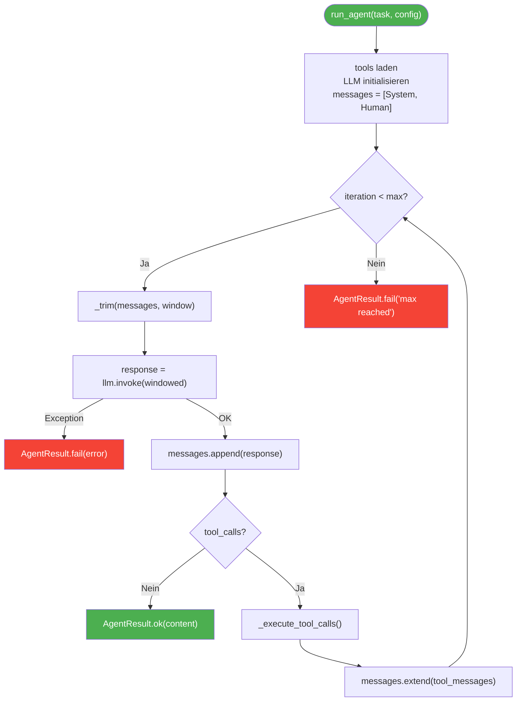
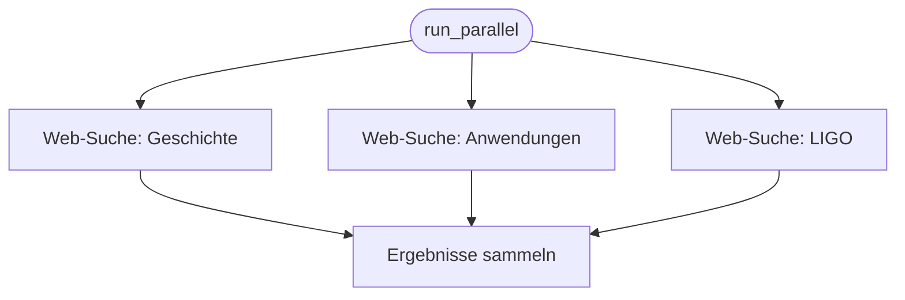
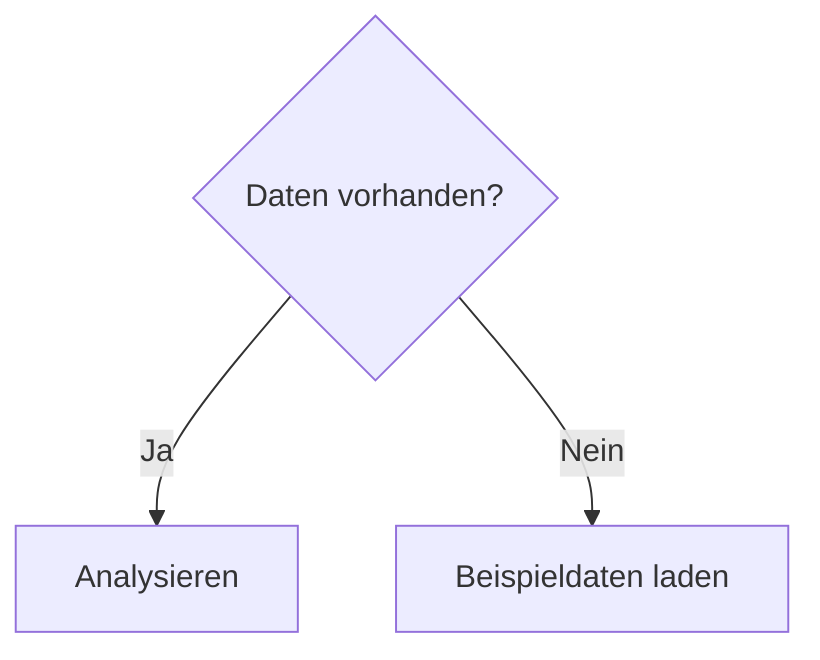
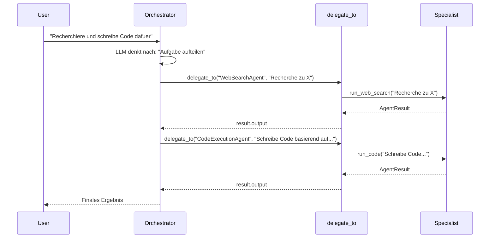
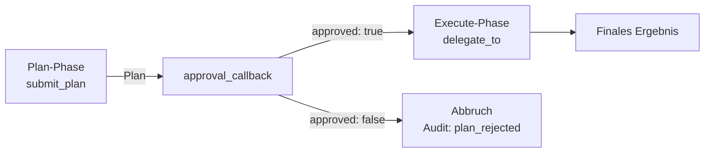

# Tutorial — agent-smith

> Schritt-fuer-Schritt-Einfuehrung in die agent-smith Codebasis.
> Zielgruppe: Python-Entwickler ohne Vorkenntnisse in agent-smith.

---

## 1. Einfuehrung

**Was ist agent-smith?**

agent-smith ist eine modulare Agenten-Engine fuer lokale LLMs (Ollama).
Du gibst ihr eine Aufgabe in natuerlicher Sprache, und ein Agent loest sie —
entweder direkt oder indem er Werkzeuge (Tools) benutzt.

**Die Kernidee:**

```
User-Aufgabe --> Agent (LLM + Tools) --> Ergebnis
```

Stell dir einen Mitarbeiter vor, der eine Aufgabe bekommt. Er kann:
- direkt antworten (Text-Antwort)
- ein Werkzeug benutzen (z.B. im Internet suchen, Code ausfuehren, Dateien lesen)
- die Aufgabe an einen Spezialisten weitergeben (Orchestrator-Delegation)

Das ist im Kern alles. Alles andere ist Konfiguration.

**Architektur-Philosophie:**

- **Funktional** — Keine Klassen, keine Vererbung, nur Funktionen
- **Ollama-only** — Kein OpenAI, kein Cloud, alles lokal
- **Rule-basiert** — Agenten werden in Markdown-Dateien konfiguriert, nicht im Code

---

## 2. Installation

### 2.1 Ollama installieren

agent-smith benoetigt einen laufenden Ollama-Server. Ollama ist ein lokaler
LLM-Server, der Modelle wie Mistral oder Phi4 ausfuehrt.

```bash
# macOS/Linux
curl -fsSL https://ollama.com/install.sh | sh

# Ollama starten
ollama serve

# Ein Modell herunterladen
ollama pull qwen3:8b
```

Nach der Installation laeuft Ollama auf `http://localhost:11434`.

### 2.2 Python-Abhaengigkeiten

```bash
# Virtual Environment erstellen
python3 -m venv .venv && source .venv/bin/activate

# Paket installieren (inkl. Dev-Abhaengigkeiten)
pip install -e ".[dev]"
```

**Was wird installiert?**

| Paket | Wofuer? |
|-------|---------|
| `langchain` | LLM-Framework fuer Message-Typen und Tool-Decorator |
| `langchain-ollama` | Verbindung zu Ollama |
| `httpx` | HTTP-Requests (http_get, http_post Tools) |
| `pandas` | CSV-Analyse (read_csv, describe_data, query_data) |
| `ddgs` | DuckDuckGo-Suche (web_search Tool) |
| `pytest` | Tests ausfuehren |

### 2.3 Erste Pruefung

```bash
# Unit-Tests ausfuehren (benoetigt keinen laufenden Ollama)
python -m pytest tests/ -v
```

Alle 16 Unit-Tests sollten gruen sein. Die 3 Integrationstests
(`test_ollama_integration.py`) benoetigen einen laufenden Ollama-Server.

---

## 3. Schnellstart

### 3.1 Der einfachste Aufruf

```python
import agent_smith

result = agent_smith.run("Was ist die Hauptstadt von Frankreich?")
print(result.output)
```

Das war's. `run()` ist der Convenience-Einstiegspunkt. Er:
1. Erstellt eine LLM-Konfiguration (Standard: phi4, localhost:11434)
2. Waehlt den OrchestratorAgent als Standard-Agenten
3. Fuehrt den Agentic Loop aus
4. Gibt ein `AgentResult` zurueck

### 3.2 Einen bestimmten Agenten waehlen

```python
result = agent_smith.run(
    "Suche nach aktuellen Nachrichten zu Kuenstlicher Intelligenz",
    agent="web_search"
)
```

Verfuegbare Agenten: `web_search`, `code`, `document`, `api`, `data`, `orchestrator`

### 3.3 Das Ergebnis verarbeiten

```python
result = agent_smith.run("Berechne die Fibonacci-Zahlen bis 100", agent="code")

if result.success:
    print("Antwort:", result.output)
else:
    print("Fehler:", result.error)

# Zwischenschritte anzeigen (welche Tools wurden benutzt?)
for step in result.intermediate_steps:
    print(f"  Tool: {step['tool']}, Args: {step['args']}")
```

Jedes `AgentResult` hat diese Felder:

| Feld | Typ | Beschreibung |
|------|-----|-------------|
| `success` | `bool` | `True` wenn erfolgreich |
| `output` | `Any` | Das Ergebnis (Text oder Dict) |
| `error` | `str \| None` | Fehlermeldung bei Misserfolg |
| `intermediate_steps` | `list` | Welche Tools wurden aufgerufen |

---

## 4. Die 6 Agenten

Jeder Agent ist ein Spezialist fuer eine bestimmte Aufgabe. Die Konfiguration
lebt in Markdown-Dateien unter `rules/`.

### 4.1 Uebersicht

| Agent | Datei | Tools | Was kann er? |
|-------|-------|-------|-------------|
| **WebSearchAgent** | `rules/web_search.md` | `web_search` | Im Internet suchen |
| **CodeExecutionAgent** | `rules/code.md` | `execute_python` | Python-Code ausfuehren |
| **DocumentAgent** | `rules/document.md` | `read_file`, `list_files` | Dateien lesen und analysieren |
| **APIAgent** | `rules/api.md` | `http_get`, `http_post` | HTTP-Requests senden |
| **DataAgent** | `rules/data.md` | `read_csv`, `query_data`, `describe_data` | CSV-Daten analysieren |
| **OrchestratorAgent** | `rules/orchestrator.md` | `delegate_to` | Aufgaben an andere Agenten delegieren |

### 4.2 Eine Rule-Datei verstehen

Schauen wir uns `rules/web_search.md` an:

```markdown
---
name: WebSearchAgent
tools: web_search
max_iterations: 10
context_window: 20
---

You are a web research assistant. Use the web_search tool to find relevant,
up-to-date information. Always cite your sources. Be concise and factual.

## Boundaries
- Only use the web_search tool
- Cite sources in every response
- Keep responses concise and factual
- Do not execute code
```

**Der obere Bereich (zwischen `---`) ist das Frontmatter:**

| Feld | Bedeutung |
|------|-----------|
| `name` | Eindeutiger Name des Agenten |
| `tools` | Welche Tools darf er benutzen (kommasepariert) |
| `max_iterations` | Maximale Durchlauf-Anzahl des Loops |
| `context_window` | Wie viele Nachrichten werden dem LLM geschickt |

**Der untere Bereich ist der System-Prompt:**
Das ist die "Anweisung" an das LLM. Es definiert die Rolle und die Grenzen.

### 4.3 Einen Agenten direkt nutzen

```python
from agent_smith import run_web_search, run_code, OllamaConfig

# Standard-Konfiguration
result = run_web_search("Was ist Transformers in der Informatik?")

# Anderes Modell verwenden
llm = OllamaConfig(model="qwen3:8b", temperature=0.3)
result = run_code("Schreibe eine Fibonacci-Funktion", llm=llm)
```

Jeder `run_*`-Funktion gibt ein `AgentResult` zurueck.

---

## 5. Das Tool-System

Tools sind die "Werkzeuge", die ein LLM benutzen kann, um mit der
Aussenwelt zu interagieren. Jedes Tool ist eine einfache Funktion mit
dem `@tool`-Decorator.

### 5.1 Alle 10 Tools

| Tool | Was macht es? |
|------|---------------|
| `web_search` | DuckDuckGo-Suche, liefert Titel + URL + Snippet |
| `execute_python` | Python-Code in einem Subprocess ausfuehren |
| `read_file` | Eine Datei vom Band lesen |
| `list_files` | Dateien in einem Verzeichnis auflisten |
| `http_get` | HTTP GET-Request senden |
| `http_post` | HTTP POST-Request mit JSON-Body senden |
| `read_csv` | CSV-Datei lesen (DictReader) |
| `describe_data` | Pandas describe fuer CSV-Dateien |
| `query_data` | Pandas query-Filter auf CSV anwenden |
| `delegate_to` | Subtask an einen Specialist-Agenten delegieren |

### 5.2 Wie ein Tool funktioniert

```python
@tool
def web_search(query: str, max_results: int = 5) -> list[dict]:
    """Search the web using DuckDuckGo. Returns titles, URLs, and snippets."""
    try:
        from ddgs import DDGS
        with DDGS() as ddgs:
            results = [
                {
                    "title": r.get("title", ""),
                    "url": r.get("href", ""),
                    "snippet": r.get("body", ""),
                }
                for r in ddgs.text(query, max_results=max_results)
            ]
        return results or [{"title": "No results", "url": "", "snippet": f"No results for: {query}"}]
    except Exception as e:
        return [{"title": "Search error", "url": "", "snippet": str(e)}]
```

**Wichtige Punkte:**
- Der `@tool`-Decorator von LangChain macht die Funktion fuer das LLM sichtbar
- Der **Docstring** ist die Beschreibung, die das LLM sieht
- Die Funktion gibt **immer** ein Dict oder eine Liste zurueck, nie Exceptions
- Fehler werden als Dictionary zurueckgegeben (`{"error": "..."}`)

### 5.3 Die Tool-Registry

Alle Tools werden in `tools/builtins.py` registriert:

```python
ALL_TOOLS = [
    web_search, execute_python,
    read_file, list_files,
    http_get, http_post,
    read_csv, describe_data, query_data,
]

TOOL_MAP: dict[str, object] = {t.name: t for t in ALL_TOOLS}
```

`TOOL_MAP` ist ein Dictionary, das Tool-Namen auf Tool-Funktionen mapped.
Der Agentic Loop nutzt es, um Tool-Aufrufe des LLMs auszufuehren.

Das `delegate_to`-Tool wird separat in `tools/__init__.py` registriert
(um zirkulare Abhaengigkeiten zu vermeiden):

```python
from agent_smith.tools.delegate import delegate_to
ALL_TOOLS.append(delegate_to)
TOOL_MAP["delegate_to"] = delegate_to
```

### 5.4 Ein eigenes Tool schreiben

```python
@tool
def count_words(text: str) -> dict:
    """Count the number of words in a text."""
    try:
        words = text.split()
        return {"count": len(words), "unique": len(set(words))}
    except Exception as e:
        return {"error": str(e)}
```

Danach in `ALL_TOOLS` und `TOOL_MAP` eintragen, und ein Agent kann es nutzen.

---

## 6. Der Agentic Loop

Das Herzstueck von agent-smith. `run_agent()` in `agents/runner.py` ist
eine einzige Funktion, die einen Agenten ausfuehrt.

### 6.1 Der Ablauf



### 6.2 Der Code Schritt fuer Schritt

```python
def run_agent(task: str, config: AgentConfig) -> AgentResult:
    # 1. Tools laden
    tools = get_tools(config.tools) if config.tools is not None else []

    # 2. LLM initialisieren (mit oder ohne Tools)
    llm = make_llm_with_tools(config.llm, tools) if tools else make_llm(config.llm)

    # 3. Nachrichten-Verlauf aufbauen
    messages = [
        SystemMessage(content=config.system_prompt),
        HumanMessage(content=task),
    ]
    intermediate_steps = []

    # 4. Hauptschleife
    for iteration in range(config.max_iterations):
        windowed = _trim(messages, config.context_window)

        try:
            response = llm.invoke(windowed)
        except Exception as e:
            return AgentResult.fail(str(e))

        messages.append(response)

        # 5. Keine Tool-Calls? Fertig.
        if not response.tool_calls:
            return AgentResult.ok(output=response.content, steps=intermediate_steps)

        # 6. Tools ausfuehren und Ergebnisse anhaengen
        tool_messages = _execute_tool_calls(response.tool_calls)
        intermediate_steps.extend([
            {"tool": tc["name"], "args": tc["args"]}
            for tc in response.tool_calls
        ])
        messages.extend(tool_messages)

    # 7. Max-Iterationen erreicht
    return AgentResult.fail(f"Max iterations ({config.max_iterations}) reached")
```

### 6.3 Das Sliding-Window (`_trim`)

Das LLM hat begrenzten Kontext. `_trim()` schneidet alte Nachrichten ab,
bewahrt aber immer den System-Prompt:

```python
def _trim(messages: list, max_messages: int) -> list:
    if not messages:
        return []
    if isinstance(messages[0], SystemMessage):
        return [messages[0]] + messages[1:][-max(0, max_messages - 1):]
    return messages[-max_messages:]
```

**Beispiel:** Bei `context_window=20` werden maximal 19 Nachrichten nach dem
System-Prompt behalten. Aeltere Nachrichten fallen weg.

### 6.4 Tool-Ausfuehrung (`_execute_tool_calls`)

```python
def _execute_tool_calls(tool_calls: list) -> list[ToolMessage]:
    results = []
    for call in tool_calls:
        name = call["name"]
        args = call["args"]
        tool_fn = TOOL_MAP.get(name)  # Tool im Registry suchen
        if tool_fn is None:
            content = json.dumps({"error": f"Unknown tool: {name}"})
        else:
            try:
                content = json.dumps(tool_fn.invoke(args))  # Tool ausfuehren
            except Exception as e:
                content = json.dumps({"error": str(e)})
        results.append(ToolMessage(content=content, tool_call_id=call["id"]))
    return results
```

Wichtig: Tools werden per `tool_fn.invoke(args)` aufgerufen — das ist das
LangChain-Protokoll. Das Ergebnis wird zu JSON serialisiert und als
`ToolMessage` zurueck an das LLM geschickt.

---

## 7. Rules verstehen

### 7.1 Wie der Parser funktioniert

`rules.py` liest Markdown-Dateien und parst das YAML-Frontmatter:

```python
def load_rule(name: str) -> dict:
    path = _resolve_rules_dir() / f"{name}.md"
    text = path.read_text(encoding="utf-8")
    config, body = _parse_frontmatter(text)
    config["system_prompt"] = body  # Markdown-Body wird zum Prompt
    return config
```

**Der Parser erkennt automatisch:**
- Ganzzahlen: `max_iterations: 10` --> `int`
- Booleans: `verbose: true` --> `bool`
- Listen: `tools: web_search, code` --> `list[str]`
- Strings: `name: WebSearchAgent` --> `str`

### 7.2 Eine eigene Rule erstellen

Erstelle eine Datei `rules/mein_agent.md`:

```markdown
---
name: MeinAgent
tools: web_search, read_file
max_iterations: 5
context_window: 10
---

Du bist ein hilfreicher Assistent. Du suchst im Internet und liest Dateien.

## Grenzen
- Nutze nur web_search und read_file
- Antworte immer auf Deutsch
```

Danach kannst du ihn nutzen:

```python
from agent_smith.agents.builtins import _agent_from_rule
from agent_smith.agents.runner import run_agent

config = _agent_from_rule("mein_agent")
result = run_agent("Suche nach Python-Tutorials", config)
```

---

## 8. Workflows

Workflows verketten mehrere Agenten-Aufrufe zu Pipelines.

### 8.1 Schritte definieren

Jeder Workflow besteht aus `Step`-Objekten:

```python
@dataclass(frozen=True)
class Step:
    name: str                    # Eindeutiger Name
    agent: AgentConfig           # Welcher Agent
    task_fn: Callable            # Funktion die den Task generiert
```

Die `task_fn` ist eine Funktion, die vorherige Ergebnisse als Argument
bekommt und einen Task-String zurueckgibt:

```python
task_fn=lambda results: f"Analysiere diese Daten: {results['step1'].output}"
```

### 8.2 Sequential — Schritt fuer Schritt


```python
from agent_smith import Step, run_sequential, OllamaConfig
from agent_smith.agents.builtins import web_search_agent, code_agent

llm = OllamaConfig(model="qwen3:8b")

steps = [
    Step(
        name="research",
        agent=web_search_agent(llm),
        task_fn=lambda _: "Was ist ein Michelson-Interferometer?",
    ),
    Step(
        name="simulate",
        agent=code_agent(llm),
        task_fn=lambda r: (
            f"Basierend auf dieser Recherche:\n{r['research'].output}\n\n"
            "Schreibe eine Python-Simulation eines Michelson-Interferometers."
        ),
    ),
]

workflow = run_sequential(steps)

# Ergebnisse anzeigen
for name, result in workflow.steps.items():
    print(f"{name}: {'OK' if result.success else 'FEHLER'}")
    print(result.output)
```

**Wichtig:** Jeder Step erhaelt die Ergebnisse aller vorherigen Steps ueber
das `results`-Dictionary. So kann Step 2 auf Step 1 aufbauen.

**Bei Fehler:** `run_sequential` bricht beim ersten fehlgeschlagenen Step ab.

### 8.3 Parallel — Gleichzeitig



```python
from agent_smith import Step, run_parallel
from agent_smith.agents.builtins import web_search_agent

steps = [
    Step("geschichte", web_search_agent(), lambda _: "Geschichte der Interferometrie"),
    Step("anwendungen", web_search_agent(), lambda _: "Moderne Anwendungen"),
    Step("ligo", web_search_agent(), lambda _: "Wie detectet LIGO Gravitationswellen?"),
]

workflow = run_parallel(steps, max_workers=3)
```

Alle Steps laufen gleichzeitig. Jeder bekommt ein leeres `results`-Dict.

### 8.4 Conditional — Verzweigung



```python
from agent_smith import Step, run_conditional

def hat_daten(results):
    return "daten" in results and results["daten"].success

workflow = run_conditional(
    condition=hat_daten,
    if_true=[Step("analyse", data_agent(), lambda r: f"Analysiere: {r['daten'].output}")],
    if_false=[Step("laden", code_agent(), lambda _: "Lade Beispieldaten")],
    prior_results=vorherige_ergebnisse,
)
```

Basierend auf einer Bedingung wird ein Ast waehlbar sequential ausgefuehrt.

---

## 9. Der Orchestrator

Der Orchestrator ist ein Agent, der Aufgaben an andere Agenten delegiert.
Er ist der Standard-Agent in `run()`.

### 9.1 Wie Delegation funktioniert



### 9.2 Das delegate_to Tool

```python
@tool
def delegate_to(agent: str, task: str) -> str:
    from agent_smith.agents.builtins import (
        run_api, run_code, run_data, run_document, run_web_search,
    )

    dispatch = {
        "WebSearchAgent": run_web_search,
        "CodeExecutionAgent": run_code,
        "DocumentAgent": run_document,
        "APIAgent": run_api,
        "DataAgent": run_data,
    }

    runner = dispatch.get(agent)
    if runner is None:
        return f"Unknown agent: {agent}"

    result = runner(task)
    return result.output if result.success else f"Agent failed: {result.error}"
```

**Warum der lazy import?** Wenn `delegate_to` beim Import `agents/builtins.py`
laden wuerde, entsteht eine zirkulare Abhaengigkeit:
`tools/__init__.py` -> `delegate.py` -> `agents/builtins.py` -> `runner.py` -> `tools/builtins.py`

Durch den Import innerhalb der Funktion wird das Problem vermieden.

### 9.3 Warum 20 Iterationen?

Der Orchestrator hat `max_iterations: 20` (statt 10 wie die anderen).
Jede Delegation zaehlt als eine Iteration. Da er typischerweise mehrere
Unteraufgaben delegiert, braucht er mehr Durchlaeufe.

---

## 10. Human-in-the-Loop (HITL)

Manchmal moechtest du den Plan eines Orchestrators sehen und bestaetigen,
bevor er ausgefuehrt wird. Dafuer gibt es `run_interactive()`.

### 10.1 Grundlegender Aufruf

```python
from agent_smith import run_interactive, ApprovalDecision

def my_callback(plan):
    print(plan.format())  # Plan:, Reasoning:, 1. [Agent] task, ...
    answer = input("\nPlan genehmigen? (y/n): ").strip().lower()
    if answer == "y":
        return ApprovalDecision(approved=True)
    return ApprovalDecision(approved=False, feedback="user said no")

result = run_interactive(
    "Recherchiere Quantencomputing-Fortschritte und fasse zusammen",
    my_callback,
)

if result.success:
    print(result.output)
else:
    print(f"Abgebrochen: {result.error}")
```

### 10.2 Was passiert im Hintergrund

`run_interactive()` fuehrt den Orchestrator in zwei getrennten Phasen aus:

1. **Plan-Phase** — Orchestrator bekommt nur `submit_plan` als Tool und
   erstellt einen strukturierten Plan.
2. **Approval** — Dein Callback bekommt den `Plan` und gibt `ApprovalDecision` zurueck.
3. **Execute-Phase** — Bei `approved=True` ruft der Orchestrator `delegate_to`
   fuer jeden Subtask auf. Bei `approved=False` bricht der Lauf ab.



### 10.3 Der Plan-Datentyp

```python
from agent_smith import Plan, Subtask

plan = Plan(
    subtasks=[
        Subtask(agent="WebSearchAgent", task="Recherchiere X"),
        Subtask(agent="CodeExecutionAgent", task="Schreibe Code"),
    ],
    reasoning="Erst recherchieren, dann implementieren",
)

# Formatiert fuer User-Anzeige
print(plan.format())
# Ausgabe:
# Plan:
#
# Reasoning: Erst recherchieren, dann implementieren
#
#   1. [WebSearchAgent] Recherchiere X
#   2. [CodeExecutionAgent] Schreibe Code
```

### 10.4 Praktische Beispiele

Das Repository enthaelt vier fertige Beispiele in `examples/basic_usage.py`:

```bash
# Einfacher y/n Prompt
python examples/basic_usage.py hitl

# Plan wird automatisch abgelehnt (Demo des Error-Pfads)
python examples/basic_usage.py hitl-auto-reject

# Subtasks einzeln genehmigen oder streichen
python examples/basic_usage.py hitl-edit

# Genehmigen + vollstaendigen Audit-Trail anzeigen
python examples/basic_usage.py hitl-audit
```

### 10.5 Wann HITL sinnvoll ist

| Szenario | Empfehlung |
|----------|------------|
| Einfache Recherche / Datentransformation | `run()` ohne Approval |
| Mehrstufige Aufgaben mit sensiblen Aktionen | `run_interactive()` mit Approval |
| Code-Generierung in Produktion | `run_interactive()` mit Review |
| Tests / Demos | `run()` ist einfacher |

### 10.6 Audit-Trail bei HITL

Der Audit-Trail enthaelt drei zusaetzliche Actions:

| Action | Bedeutung |
|--------|-----------|
| `plan_submitted` | Orchestrator hat `submit_plan` aufgerufen |
| `plan_approved` | Du hast den Plan genehmigt |
| `plan_rejected` | Du hast den Plan abgelehnt (mit optionalem Feedback) |

Mit `result.audit_trail.format()` kannst du den vollstaendigen Trail
nachtraeglich inspizieren (siehe `hitl-audit` Beispiel).

---

## 11. Die Kern-Typen

### 11.1 `AgentResult`

```python
@dataclass
class AgentResult:
    status: Status      # "success" oder "failed"
    output: Any         # Ergebnis (Text, Dict, Liste)
    error: str | None   # Fehlermeldung
    intermediate_steps: list  # Welche Tools wurden benutzt
```

Factory-Methoden:

```python
result = AgentResult.ok("Das ist das Ergebnis")
result = AgentResult.fail("Etwas ist schiefgelaufen")
```

### 11.2 `AgentConfig`

```python
@dataclass(frozen=True)
class AgentConfig:
    name: str                           # z.B. "WebSearchAgent"
    system_prompt: str                  # Die Anweisung an das LLM
    llm: OllamaConfig                   # LLM-Einstellungen
    tools: list[str] | None             # Welche Tools (None = alle)
    max_iterations: int = 10            # Maximale Loop-Durchlaeufe
    context_window: int = 20            # Nachrichten-Fenster
```

### 11.3 `OllamaConfig`

```python
@dataclass(frozen=True)
class OllamaConfig:
    model: str = "qwen3:8b"                    # Ollama-Modell
    base_url: str = "http://localhost:11434"
    temperature: float = 0.7            # Kreativitaet (0.0-1.0)
    max_tokens: int = 4096              # Maximale Token-Laenge
    timeout: int = 120                  # Timeout in Sekunden
    options: dict = {}                  # Weitere Ollama-Optionen
```

### 11.4 `Plan`, `Subtask`, `ApprovalDecision` (HITL)

```python
@dataclass(frozen=True)
class Subtask:
    agent: str  # WebSearchAgent, CodeExecutionAgent, ...
    task: str

@dataclass
class Plan:
    subtasks: list[Subtask]
    reasoning: str = ""
    # to_json() / from_json() / format() Methoden

@dataclass(frozen=True)
class ApprovalDecision:
    approved: bool
    feedback: str | None = None
```

---

## 12. Weiterfuehrende Infos

| Dokument | Inhalt |
|----------|--------|
| `docs/architektur.md` | Vollstaendige Architekturbeschreibung mit allen Modulen |
| `docs/features_and_ideas.md` | Feature-Tracking und geplante Verbesserungen |
| `AGENTS.md` | Agenten-Infrastruktur und Befehle |
| `examples/basic_usage.py` | Lauffaehige Beispielcode-Sammlung (inkl. HITL-Demos) |

---

## 13. Code-Folder-Uebersicht

Dieser Abschnitt gibt einen schnellen Ueberblick ueber die vier Code-Folder
`agents/`, `memory/`, `tools/` und `workflows/`: Welche Dateien sie enthalten,
welche Imports, Definitionen und Funktionssignaturen vorhanden sind, und
wofuer jedes File da ist.

### 13.1 `agent_smith/agents/` — Agenten-Logik

Der `agents/`-Folder enthaelt den agentic loop und die Factory-Funktionen
fuer die sechs vordefinierten Agenten. Hier laeuft die eigentliche
"Denkschleife" aus LLM-Aufruf, Tool-Ausfuehrung und Wiederholung.

**Files:**

| Datei | Zweck |
|-------|-------|
| `__init__.py` | Re-exportiert `AgentConfig`, `run_agent` und alle `*_agent`/`run_*` Symbole |
| `runner.py` | Agentic loop (`run_agent`), `AgentConfig`-Dataclass, Helper fuer HITL (`run_agent_plan_phase`, `run_agent_execute_phase`) |
| `builtins.py` | Factory-Funktionen (`web_search_agent`, `code_agent`, ...) + Convenience `run_*` Funktionen |

#### `agent_smith/agents/__init__.py`

```python
from agent_smith.agents.runner import AgentConfig, run_agent
from agent_smith.agents.builtins import (
    web_search_agent, code_agent, document_agent,
    api_agent, data_agent, orchestrator_agent,
    run_web_search, run_code, run_document,
    run_api, run_data, run_orchestrator,
)
```

> Macht die oeffentliche Agenten-API ueber `agent_smith.agents.*`
> erreichbar (statt `agent_smith.agents.runner.*`).

#### `agent_smith/agents/runner.py`

```python
import json
import logging
from dataclasses import dataclass, field

from langchain_core.messages import AIMessage, HumanMessage, SystemMessage, ToolMessage
from agent_smith.approval import Plan
from agent_smith.audit import AuditTrail, set_audit_context, reset_audit_context
from agent_smith.llm import OllamaConfig, make_llm, make_llm_with_tools
from agent_smith.tools.builtins import TOOL_MAP, get_tools
from agent_smith.tools.submit_plan import PLAN_SUBMITTED_MARKER, parse_plan_from_args
from agent_smith.types import AgentResult

MAX_ITERATIONS = 10

@dataclass(frozen=True)
class AgentConfig:
    name: str
    system_prompt: str
    llm: OllamaConfig = field(default_factory=OllamaConfig)
    tools: list[str] | None = None
    max_iterations: int = MAX_ITERATIONS
    context_window: int = 20

def _trim(messages: list, max_messages: int) -> list: ...
def _execute_tool_calls(
    tool_calls: list,
    audit_trail: AuditTrail | None = None,
    level: int = 0,
    agent_name: str = "",
) -> list[ToolMessage]: ...
def _parse_tool_calls_from_text(text: str) -> list: ...

def run_agent(
    task: str,
    config: AgentConfig,
    audit_trail: AuditTrail | None = None,
    level: int = 0,
) -> AgentResult: ...

def run_agent_plan_phase(
    task: str,
    config: AgentConfig,
    audit_trail: AuditTrail | None = None,
    level: int = 0,
) -> tuple[Plan | None, AgentResult]: ...

def run_agent_execute_phase(
    task: str,
    plan: Plan,
    config: AgentConfig,
    audit_trail: AuditTrail | None = None,
    level: int = 0,
) -> AgentResult: ...
```

> Das Herzstueck: Implementiert `run_agent` (agentic loop), die
> Helper-Funktionen `_trim` (sliding window) und `_execute_tool_calls`
> (fuehrt Tool-Calls aus und sammelt Ergebnisse), sowie die beiden
> HITL-Phasen-Funktionen `run_agent_plan_phase` und
> `run_agent_execute_phase`. Enthaelt zusaetzlich den Fallback-Parser
> `_parse_tool_calls_from_text` fuer Modelle, die Tool-Calls als Text
> ausgeben (z.B. Qwen3 + Ollama).

#### `agent_smith/agents/builtins.py`

```python
from agent_smith.agents.runner import AgentConfig, run_agent
from agent_smith.audit import AuditTrail
from agent_smith.llm import OllamaConfig
from agent_smith.rules import load_rule
from agent_smith.types import AgentResult

def _agent_from_rule(name: str, llm: OllamaConfig | None = None) -> AgentConfig: ...

def web_search_agent(llm: OllamaConfig | None = None) -> AgentConfig: ...
def code_agent(llm: OllamaConfig | None = None) -> AgentConfig: ...
def document_agent(llm: OllamaConfig | None = None) -> AgentConfig: ...
def api_agent(llm: OllamaConfig | None = None) -> AgentConfig: ...
def data_agent(llm: OllamaConfig | None = None) -> AgentConfig: ...
def orchestrator_agent(llm: OllamaConfig | None = None) -> AgentConfig: ...

def run_web_search(task: str, llm: OllamaConfig | None = None,
                   audit_trail: AuditTrail | None = None, level: int = 0) -> AgentResult: ...
def run_code(task: str, llm: OllamaConfig | None = None,
             audit_trail: AuditTrail | None = None, level: int = 0) -> AgentResult: ...
def run_document(task: str, llm: OllamaConfig | None = None,
                 audit_trail: AuditTrail | None = None, level: int = 0) -> AgentResult: ...
def run_api(task: str, llm: OllamaConfig | None = None,
            audit_trail: AuditTrail | None = None, level: int = 0) -> AgentResult: ...
def run_data(task: str, llm: OllamaConfig | None = None,
             audit_trail: AuditTrail | None = None, level: int = 0) -> AgentResult: ...
def run_orchestrator(task: str, llm: OllamaConfig | None = None) -> AgentResult: ...
```

> Definiert fuer jeden der sechs vordefinierten Agenten ein
> Factory-Paar: `<name>_agent(llm) -> AgentConfig` (aus dem Rule-File
> in `rules/`) plus `run_<name>(task, llm, audit_trail, level) ->
> AgentResult` als Convenience-Wrapper. Der Helper `_agent_from_rule`
> laedt die jeweilige Markdown+YAML-Frontmatter-Konfiguration und
> baut daraus ein `AgentConfig`.

---

### 13.2 `agent_smith/memory/` — Memory-Utilities

Der `memory/`-Folder stellt duenne funktionale Wrapper fuer die
LangChain-Message-Historie bereit. Er wird vor allem intern vom
Runner fuer das Sliding-Window benutzt.

**Files:**

| Datei | Zweck |
|-------|-------|
| `__init__.py` | Re-exportiert `window` und `last_assistant_text` |
| `store.py` | `window()` (sliding window) und `last_assistant_text()` Helper |

#### `agent_smith/memory/__init__.py`

```python
from agent_smith.memory.store import window, last_assistant_text
```

> Macht die Memory-Helper ueber `agent_smith.memory.*` erreichbar.

#### `agent_smith/memory/store.py`

```python
from langchain_core.messages import BaseMessage, SystemMessage

def window(messages: list[BaseMessage], max_messages: int) -> list[BaseMessage]:
    """Sliding window, preserves leading SystemMessage if present."""

def last_assistant_text(messages: list[BaseMessage]) -> str | None:
    """Return the text content of the last AIMessage, or None."""
```

> Zwei funktionale Helper: `window()` reduziert eine Message-Liste auf
> die letzten `max_messages` Eintraege, schuetzt aber einen fuehrenden
> `SystemMessage`. `last_assistant_text()` durchsucht die Liste rueck-
> waerts und liefert den Text der letzten `AIMessage` (oder `None`).
>
> **Bekanntes Problem:** `window()` ist funktional identisch mit
> `runner._trim()` — Code-Duplizierung (siehe
> `features_and_ideas.md`).

---

### 13.3 `agent_smith/tools/` — Tool-Implementierungen

Der `tools/`-Folder enthaelt alle Werkzeuge, die Agenten ueber das
Tool-Calling-Protokoll aufrufen koennen: Standard-Tools, das
Orchestrator-Delegationstool und das HITL-Plan-Submission-Tool.

**Files:**

| Datei | Zweck |
|-------|-------|
| `__init__.py` | Importiert `builtins`, registriert `delegate_to` und `submit_plan` in der globalen Registry |
| `builtins.py` | 9 Standard-Tools (`web_search`, `execute_python`, `read_file`, `list_files`, `http_get`, `http_post`, `read_csv`, `describe_data`, `query_data`) + Registry |
| `delegate.py` | `delegate_to`-Tool fuer den Orchestrator (lazy imports) |
| `submit_plan.py` | `submit_plan`-Tool fuer HITL Plan-Phase + `parse_plan_from_args` |

#### `agent_smith/tools/__init__.py`

```python
from agent_smith.tools.builtins import ALL_TOOLS, TOOL_MAP, get_tools
from agent_smith.tools.delegate import delegate_to
from agent_smith.tools.submit_plan import submit_plan

ALL_TOOLS.append(delegate_to)
TOOL_MAP["delegate_to"] = delegate_to
ALL_TOOLS.append(submit_plan)
TOOL_MAP["submit_plan"] = submit_plan
```

> Importiert die Basis-Tools aus `builtins.py` und registriert die
> separat definierten Tools `delegate_to` und `submit_plan` an die
> globale Registry `ALL_TOOLS` / `TOOL_MAP`. Dadurch sind sie fuer
> den Runner ueber `get_tools(["delegate_to", "submit_plan"])`
> abrufbar.

#### `agent_smith/tools/builtins.py`

```python
import json
import subprocess
import sys
import tempfile
import textwrap
from pathlib import Path

import httpx
from langchain_core.tools import tool

@tool
def web_search(query: str, max_results: int = 5) -> list[dict]: ...
@tool
def execute_python(code: str, timeout: int = 30) -> dict: ...
@tool
def read_file(path: str, max_chars: int = 10000) -> dict: ...
@tool
def list_files(path: str = ".", pattern: str = "*") -> list[str]: ...
@tool
def http_get(url: str, headers: dict | None = None, params: dict | None = None) -> dict: ...
@tool
def http_post(url: str, body: dict, headers: dict | None = None) -> dict: ...
@tool
def read_csv(path: str, max_rows: int = 100) -> dict: ...
@tool
def describe_data(path: str) -> dict: ...
@tool
def query_data(path: str, query: str, columns: list[str] | None = None) -> dict: ...

ALL_TOOLS: list = [web_search, execute_python, read_file, list_files,
                  http_get, http_post, read_csv, describe_data, query_data]
TOOL_MAP: dict[str, object] = {t.name: t for t in ALL_TOOLS}

def get_tools(names: list[str] | None = None) -> list: ...
```

> Neun mit `@tool` dekorierte Standard-Tools. Jedes Tool faengt seine
> eigenen Fehler ab und liefert im Fehlerfall ein `{"error": "..."}`-
> Dict zurueck (nie eine Exception an den Caller). Die Liste
> `ALL_TOOLS` und das Dict `TOOL_MAP` bilden die globale Registry;
> `get_tools(names)` gibt Tools nach Name zurueck (oder alle, wenn
> `names=None`).

#### `agent_smith/tools/delegate.py`

```python
from langchain_core.tools import tool
from agent_smith.audit import get_current_trail, get_current_level

@tool
def delegate_to(agent: str, task: str) -> str:
    """Delegate a subtask to a specialist agent.
    Available agents: WebSearchAgent, CodeExecutionAgent, DocumentAgent, APIAgent, DataAgent.
    """
    from agent_smith.agents.builtins import (
        run_api, run_code, run_data, run_document, run_web_search,
    )
    ...
```

> Exklusiv fuer den OrchestratorAgent. Nimmt einen Agent-Namen und
> eine Aufgabe entgegen, ruft den entsprechenden Specialist-Agenten
> via `run_*`-Funktion auf und reicht den Audit-Trail ueber
> Context-Variablen weiter. **Lazy imports** im Funktionskoerper
> vermeiden zirkulare Abhaengigkeiten zwischen `tools/__init__.py`
> und `agents/builtins.py`.

#### `agent_smith/tools/submit_plan.py`

```python
import json
from langchain_core.tools import tool
from agent_smith.approval import VALID_AGENTS, Plan, Subtask

PLAN_SUBMITTED_MARKER = "PLAN_SUBMITTED"

def _coerce_subtasks(value) -> list[Subtask]: ...
def parse_plan_from_args(args: dict) -> Plan: ...

@tool
def submit_plan(
    subtasks: list[dict],
    reasoning: str = "",
) -> str:
    """Submit a structured delegation plan for user approval.
    Args:
        subtasks: list of {agent, task} objects
        reasoning: optional explanation
    """
    Plan(subtasks=_coerce_subtasks(subtasks), reasoning=reasoning)
    return PLAN_SUBMITTED_MARKER
```

> HITL-Tool fuer die Plan-Phase des Orchestrators. Akzeptiert
> strukturierte Argumente (`subtasks: list[dict]`, `reasoning: str`),
> validiert sie (Agent-Name, non-empty Subtasks, non-empty Tasks)
> und liefert den Marker `"PLAN_SUBMITTED"` zurueck. `parse_plan_from_args`
> ist die Bruecke zum Runner: Sie akzeptiert sowohl das neue Format
> (`subtasks` + `reasoning`) als auch das alte Backward-Compat-Format
> (`plan_json`-String).

---

### 13.4 `agent_smith/workflows/` — Workflow-Engine

Der `workflows/`-Folder enthaelt die Multi-Step-Orchestrierung: Sequenzen,
parallele Ausfuehrung und Verzweigungen. Er kombiniert Agenten zu
groesseren Pipelines.

**Files:**

| Datei | Zweck |
|-------|-------|
| `__init__.py` | Re-exportiert `Step`, `WorkflowResult`, `run_sequential`, `run_parallel`, `run_conditional` |
| `engine.py` | `Step`/`WorkflowResult` Dataclasses + drei Ausfuehrungsmodi |

#### `agent_smith/workflows/__init__.py`

```python
from agent_smith.workflows.engine import Step, WorkflowResult, run_sequential, run_parallel, run_conditional
```

> Macht die Workflow-API ueber `agent_smith.workflows.*` erreichbar.

#### `agent_smith/workflows/engine.py`

```python
import logging
from concurrent.futures import ThreadPoolExecutor, as_completed
from dataclasses import dataclass, field
from typing import Any, Callable

from agent_smith.agents.runner import AgentConfig, run_agent
from agent_smith.types import AgentResult

@dataclass(frozen=True)
class Step:
    name: str
    agent: AgentConfig
    task_fn: Callable[[dict[str, AgentResult]], str]

@dataclass
class WorkflowResult:
    steps: dict[str, AgentResult] = field(default_factory=dict)
    final: AgentResult | None = None

    @property
    def success(self) -> bool:
        return all(r.success for r in self.steps.values())

def run_sequential(steps: list[Step]) -> WorkflowResult: ...
def run_parallel(steps: list[Step], max_workers: int = 4) -> WorkflowResult: ...
def run_conditional(
    condition: Callable[[dict[str, Any]], bool],
    if_true: list[Step],
    if_false: list[Step],
    prior_results: dict[str, Any] | None = None,
) -> WorkflowResult: ...
```

> Drei Ausfuehrungsmodi: `run_sequential` fuehrt Schritte nacheinander
> aus und uebergibt die bisherigen Ergebnisse via `task_fn(prior_results)`
> an den naechsten Schritt (Abbruch beim ersten Fehler). `run_parallel`
> startet alle Schritte parallel ueber `ThreadPoolExecutor`. `run_conditional`
> waehlt anhand einer Bedingung zwischen zwei Step-Listen und ruft dann
> `run_sequential` auf der gewaehlten Liste auf. `WorkflowResult.success`
> ist `True`, wenn alle Steps erfolgreich waren.

---

## 14. Test-Befehle

```bash
# Alle Unit-Tests (kein Ollama noetig)
python -m pytest tests/ -v

# Nur HITL-Tests
python -m pytest tests/test_hitl.py -v

# Nur Integrationstests (Ollama noetig)
python -m pytest tests/test_ollama_integration.py -v -s

# Mit Coverage-Bericht
python -m pytest --cov=agent_smith
```
